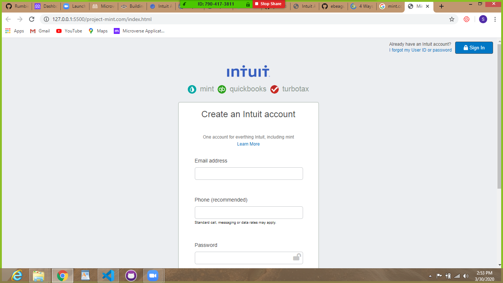

# Project-Mint.com
This is a clone of the sign up page for mint.com. This project is meant to equip us with the necessary skills needed to design a professional web sign up page.

# Live demo 
[Live demo](https://raw.githack.com/Rumbie-Mudzie7/project-mint.com/feature-branch/index.html)

## Built With

- HTML
- CSS

## Getting Started

To get a local copy up and running follow these simple example steps.
 - Clone or download this repository to your local workstation.

### Prerequisites
There are no prerequisits to run the project.

### Usage
 enter the directory where you cloned or downloaded the project and open index.html file using your favorite browser
 
## Authors

👤 **Ebeagu Samuel**

- Github: [@ebeagusamuel](https://github.com/ebeagusamuel)
- Twitter: [@ebeagu_samuel](https://twitter.com/ebeagu_samuel)

👤 **Rumbie Mudzie**

- Github: [@Rumbie-Mudzie7](https://github.com/Rumbie-Mudzie7)
- Twitter: [@RumbidzayiMudz3](https://twitter.com/RumbidzayiMudz3)
## 🤝 Contributing

Contributions, issues and feature requests are welcome!

Feel free to check the [issues page](issues/).

## Show your support

Give a ⭐️ if you like this project!

## Acknowledgments

- Hat tip to anyone whose code was used
- Inspiration
- etc

## 📝 License

This project is [MIT](lic.url) licensed.
